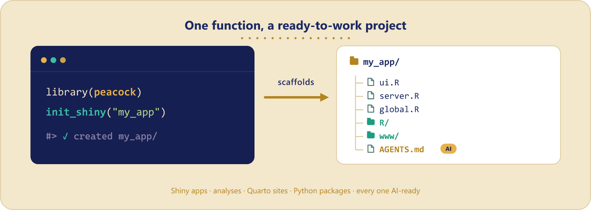

<!-- README.md is generated from README.Rmd. Please edit that file -->

```{r, include = FALSE}
knitr::opts_chunk$set(
  collapse = TRUE,
  comment = "#>",
  fig.path = "man/figures/README-",
  out.width = "100%"
)
```

# peacock 

<!-- badges: start -->
[](https://lifecycle.r-lib.org/articles/stages.html#experimental)
[](https://samuelbharti.r-universe.dev/peacock)
[](https://github.com/samuelbharti/peacock/actions/workflows/r.yaml)
[](https://doi.org/10.5281/zenodo.21350436)
[](https://github.com/samuelbharti/peacock/blob/main/LICENSE)
<!-- badges: end -->

peacock sets up a ready-to-work project directory in one call: the layout, the
config files, and the agent guidance. It scaffolds R projects, and also Quarto
and Python ones, so the same habit works across a mixed stack.



## Installation

From r-universe:

``` r
install.packages("peacock", repos = "https://samuelbharti.r-universe.dev")
```

Or the development version:

``` r
# install.packages("pak")
pak::pak("samuelbharti/peacock/pkg-r")
```

## What can peacock do?

### 1. Initialize a Shiny app structure

Creates a complete Shiny app with organized folders and starter files.

```{r example, eval = FALSE}
library(peacock)

# Set up a new Shiny project
init_shiny(path = "my_shiny_app")
```

This creates:

- `ui.R`, `server.R`, `global.R` - Your main Shiny files
- `modules/` - For modular Shiny components
- `userInterface/` - UI components organized separately
- `www/` - Static files (CSS, images, JavaScript)
- `data/`, `R/`, `dev/` - Standard project folders
- `Dockerfile` - Ready for containerization
- `.gitignore` and `.Renviron` - Project configuration

Set `confirm = FALSE` to skip the confirmation prompt, which is what you want
in a script.

### 2. Create a changelog

Track project changes in a structured markdown file.

```{r eval = FALSE}
init_changelog_md(path = "my_project")
```

Creates a `CHANGELOG.md` file with a simple format for documenting your work.

### 3. Use GitHub templates

Pull down complete project templates from GitHub. Use a built-in name, or **any**
GitHub repository as `"owner/repo"` (optionally pinned with `"owner/repo@ref"`).

```{r eval = FALSE}
# Built-in templates
init_template("shiny", path = "my_project")
init_template("cgds", path = "research_project")

# Any GitHub repo, optionally pinned to a branch, tag, or commit
init_template("owner/repo", path = "my_project")
init_template("owner/repo@dev", path = "my_project")

# See the built-in templates
peacock_templates()
```

The CGDS template is part of the [UAB CGDS research workflow](https://github.com/uab-cgds-worthey/cgds_repo_template).

### 4. Set up tool review projects

Organize projects that compare multiple tools or methods.

```{r eval = FALSE}
tool_review_template(
  tool_name = c("tool1", "tool2", "tool3"),
  tool_url = c("https://tool1.com", "https://tool2.com", "https://tool3.com"),
  path = "tool_comparison"
)
```

This creates organized folders for data, scripts, outputs, and documentation for each tool.

### 5. Scaffold a reproducible analysis project

Set up a tidy layout for a data-analysis or research project.

```{r eval = FALSE}
init_analysis(path = "my_study")
```

Creates `data/{raw,processed}`, `R/`, `analysis/` (with a starter Quarto notebook),
and `output/{figures,tables}`, plus a README and `.gitignore`.

### 6. Scaffold a Quarto project

Create a Quarto website, book, or manuscript.

```{r eval = FALSE}
init_quarto(path = "my_site", type = "website")
```

`type` can be `"website"` (default), `"book"`, or `"manuscript"`; each gets a
`_quarto.yml` and starter documents.

### 7. Scaffold a Python project

peacock stays an R package, but it can emit a Python project too.

```{r eval = FALSE}
init_python(path = "my_pkg")
```

Creates a src-layout package with `pyproject.toml` (ruff + pytest), a starter
module and test, `.gitignore`, and `AGENTS.md`.

### Every project is AI-ready

peacock's project scaffolds all drop an `AGENTS.md`
(plus a `CLAUDE.md` that imports it) describing how to run, build, and work in the
project, so AI coding assistants are productive from the first commit.

## RStudio Integration

Once installed, peacock adds an RStudio Add-in for quick access:

- Find "Peacock: Shiny Template" in the Addins menu
- Or create a new project and select "Peacock: Shiny Template" from the templates

## Learn more

- Full documentation: https://www.samuelbharti.com/peacock/r/
- Vignette: `vignette("introduction")`
- Issues and feedback: https://github.com/samuelbharti/peacock/issues

## License

MIT © Samuel Bharti

